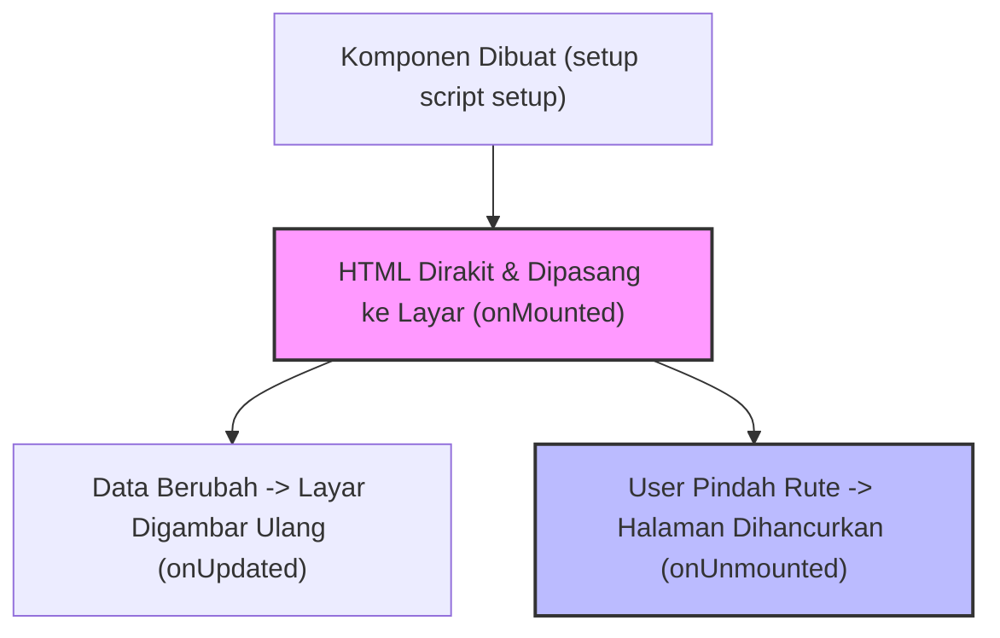

# Hari 58: Lifecycle Hooks di Vue 3
## Menguasai Siklus Hidup Komponen onMounted & onUnmounted untuk Manajemen Event Medis

Selamat datang di Hari 58! Hari ini kita akan mempelajari konsep **Lifecycle Hooks** (Kait Siklus Hidup) komponen di Vue 3, dengan fokus pada dua kait terpopuler: **`onMounted`** dan **`onUnmounted`**.

Sebuah komponen halaman web di browser bertindak seperti makhluk hidup: ia dilahirkan (dibuat di memori), tumbuh besar dan dipasang ke layar browser (*Mounting*), mengalami perubahan data (*Updating*), dan pada akhirnya mati serta dicopot dari layar saat user berpindah halaman (*Unmounting*). Memahami siklus ini sangat penting untuk inisialisasi library eksternal dan mencegah kebocoran memori RAM komputer.

---

## 1. Peta Siklus Hidup Komponen Vue 3

Berikut adalah urutan kronologis siklus hidup komponen sejak lahir hingga hancur:



*   **`setup()` / `<script setup>`**: Tempat pertama kali variabel reaktif dideklarasikan di memori RAM. Pada tahap ini, tag HTML **belum dirakit di layar**, sehingga kita dilarang memanipulasi element DOM.
*   **`onMounted()`**: Terpicu sesaat setelah HTML digambar kokoh di browser. Ini adalah tempat teraman untuk membaca ukuran lebar layar, memicu fokus kursor otomatis, atau menyalakan peta Leaflet.
*   **`onUnmounted()`**: Terpicu sesaat setelah komponen dibongkar habis dari layar browser. Ini adalah tempat wajib untuk membersihkan sisa-sisa program sampah (seperti mematikan pengatur waktu interval `setInterval` atau menghentikan sensor map GPS).

---

## 2. Studi Kasus PMI: Polling Waktu Real-time dengan Mencegah Memory Leak

Mari kita buat komponen pencatat waktu dinas yang memicu update setiap detik, dan memastikan pengatur waktu dimatikan saat petugas keluar dari halaman agar memori HP petugas tidak jebol melambat (*Memory Leak*).

```html
<!-- components/TimerDinas.vue -->
<template>
  <div class="p-4 bg-slate-900 text-emerald-400 font-mono text-xs rounded-xl flex items-center justify-between">
    <span>⏱️ DURASI DINAS PETUGAS:</span>
    <strong>{{ formatWaktu(detikDinas) }}</strong>
  </div>
</template>

<script setup>
import { ref, onMounted, onUnmounted } from 'vue';

const detikDinas = ref(0);
let timerId = null;

// 1. FORMAT MENIT DETIK
const formatWaktu = (totalDetik) => {
  const menit = Math.floor(totalDetik / 60);
  const detik = totalDetik % 60;
  return `${menit.toString().padStart(2, '0')}:${detik.toString().padStart(2, '0')} Detik`;
};

// 2. LIFECYCLE MOUNTED: Nyalakan interval setelah layar siap
onMounted(() => {
  console.log("Komponen Timer dipasang di layar. Memulai penghitung waktu...");
  
  timerId = setInterval(() => {
    detikDinas.value++;
  }, 1000); // Bertambah 1 setiap detik
});

// 3. LIFECYCLE UNMOUNTED: Bersihkan interval saat halaman ditutup
onUnmounted(() => {
  console.log("Komponen Timer dibongkar. Mematikan interval di memori RAM...");
  
  if (timerId) {
    clearInterval(timerId); // MEMBUNUH INTERVAL AGAR TIDAK BOCOR!
  }
});
</script>
```

---

## 3. Latihan Soal Mandiri
1. Amati penggunaan fungsi `clearInterval(timerId)` di dalam blok `onUnmounted` di atas.
2. Jelaskan bahaya tersembunyi bagi performa RAM komputer/HP petugas jika kita lupa memanggil fungsi `clearInterval()` saat komponen tersebut dibongkar dari layar.
3. Sebutkan mengapa kita dilarang keras mencoba membaca properti tinggi kontainer HTML (seperti `document.getElementById('map').offsetHeight`) langsung di root script setup tanpa dibungkus di dalam hook `onMounted`.

---

## 4. Kunci Jawaban Soal & Penjelasan

### Jawaban 1 & 2: Bahaya Kebocoran Memori (Memory Leak)
*   **Memory Leak**: Fungsi `setInterval` dijalankan oleh sistem operasi peramban di latar belakang. Jika kita berpindah halaman dan komponen `TimerDinas` dibongkar dari layar visual, sistem operasi browser **tidak akan menghentikan fungsi interval tersebut secara otomatis** jika tidak diperintahkan.
*   **Akibatnya**: Fungsi interval akan terus berputar di RAM latar belakang selamanya menaikkan angka `detikDinas` yang sudah tidak ada wujud visualnya di layar. Jika petugas berpindah halaman bolak-balik sebanyak 20 kali, akan tercipta 20 fungsi interval hantu yang berputar bersamaan di RAM, menyebabkan aplikasi web melambat secara perlahan (*Lag*) hingga akhirnya browser mogok kehabisan memori (*Crash Out of Memory*).

### Jawaban 3: Masalah DOM di Script Setup
*   **Alasan**: Script setup dieksekusi di fase inisialisasi awal (*Creation Phase*). Pada milidetik tersebut, Vue baru membaca deklarasi Javascript dan **belum membuat pohon HTML di halaman**.
*   Mencari ID elemen di tahap ini akan menghasilkan nilai **`null` / `undefined`**, memicu error merah fatal *"Cannot read properties of null (reading 'offsetHeight')"* yang menghentikan jalannya seluruh program website. Membungkusnya di `onMounted` menjamin kode dijalankan hanya setelah elemen HTML sudah terlukis nyata di layar browser.
